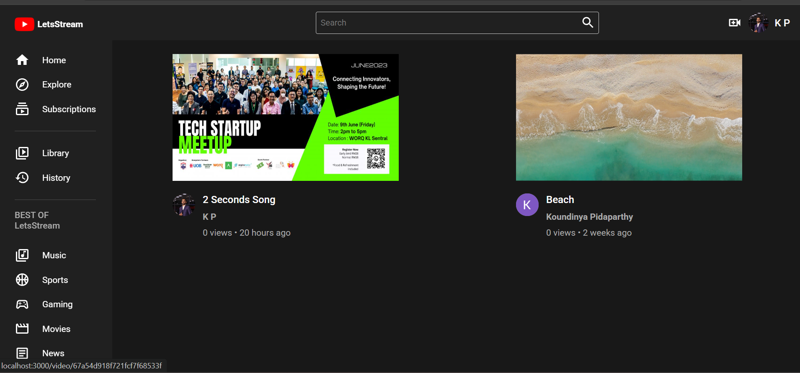
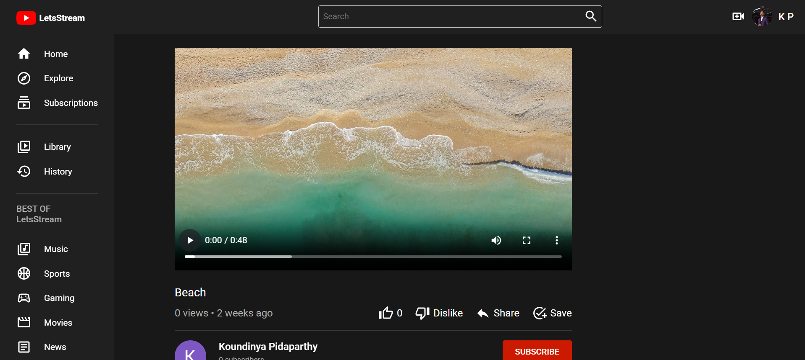

# LetsStream

LetsStream is a video streaming application built using React, Node.js, Express.js, and Firebase, designed to allow users to upload and play videos. It functions as a basic YouTube clone with essential video management features.

## Screenshots


1. **Home Screen:**
   

2. **Video Stream Screen:**
   


## Features
- **Video Upload**: Users can upload their videos to the platform.
- **Video Playback**: Uploaded videos can be played directly on the application.
- **User Authentication**: Firebase authentication can be integrated for user-specific video management (optional).

## Technologies Used
- **React**: Frontend framework for building the user interface.
- **Node.js & Express.js**: Backend framework used for managing microservices.
- **Firebase**: Used for video storage and database management.
- **CSS/Bootstrap**: Styling for the UI.

## Installation
1. Clone the repository:
   ```sh
   git clone https://github.com/yourusername/LetsStream.git
   ```
2. Navigate to the project directory:
   ```sh
   cd LetsStream
   ```
3. Install dependencies:
   ```sh
   npm install
   ```
4. Set up Firebase:
   - Create a Firebase project.
   - Enable Firestore and Firebase Storage.
   - Get the Firebase configuration and add it to the project.

5. Start the application:
   ```sh
   npm start
   ```

## Future Enhancements
- Implement user authentication for personalized video storage.
- Add video categories and search functionality.
- Enable comments and likes on videos.
- Improve UI/UX design for a better experience.


